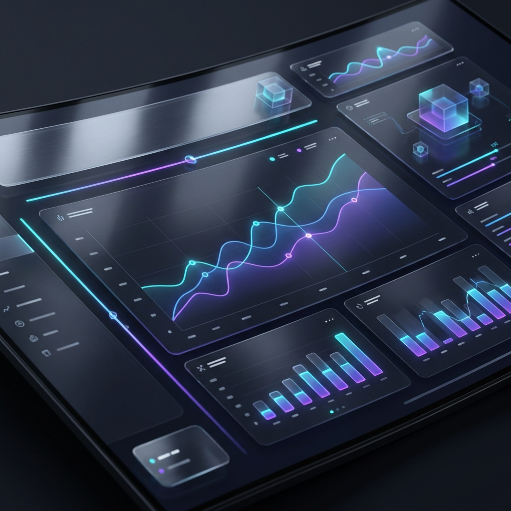

# AdCoach - The Future of AI Advertising 🚀



**AdCoach** is a next-generation AI advertising platform designed for high-growth brands. It combines **premium aesthetics**, **autonomous agents**, and **dynamic design** to create an immersive user experience.

Built with **Next.js 16**, **Tailwind CSS**, and **Framer Motion**, AdCoach treats the user interface as a first-class feature, not just a wrapper.

---

## ✨ Key Features

### 🎨 Premium Visual Experience
-   **Dynamic Shader Backgrounds**: Custom-built WebGL shaders that shift themes based on page context (Midnight Lavender for Auth, Hypnotic Ocean for Pricing).
-   **Glassmorphism Everywhere**: High-quality frosted glass effects (`backdrop-blur-md`) grounded by a "Premium Dark" aesthetic.
-   **Bento Grid Layout**: A modern, asymmetric grid layout for the "Features" and "Home" sections, powered by **Spotlight** hover effects.
-   **Apple-Level Animations**: Smooth scrolling (Lenis), parallax depth, and magnetic button interactions.

### 🛡️ Secure & Smart Authentication
-   **Google OAuth Integration**: One-click "Continue with Google" sign-in using **NextAuth.js**.
-   **Smart Email Validation**: Strictly filters out suspicious/temporary domains while allowing all professional and legitimate email providers.
-   **Zod Schema Validation**: Robust form handling for Login, Signup, and Contact forms.

### ⚡ Interactive Components
-   **Pricing Modal**: A portal-based, z-index-proof modal that overlays the entire app for a focused checkout experience.
-   **Easter Eggs**: Try entering the **Konami Code** (`↑ ↑ ↓ ↓ ← → ← → B A`) or clicking "Join Waitlist" for a surprise!
-   **Data Visualization**: Custom-built abstract UI graphics (`GraphicDashboard`, `GraphicVideo`) to represent features without generic icons.

---

## 🛠️ Tech Stack

-   **Framework**: [Next.js 16](https://nextjs.org/) (App Router)
-   **Styling**: [Tailwind CSS v4](https://tailwindcss.com/)
-   **UI Library**: [Shadcn UI](https://ui.shadcn.com/) (Radix Primitives)
-   **Animations**: [Framer Motion](https://www.framer.com/motion/) + [GSAP](https://gsap.com/)
-   **Auth**: [NextAuth.js](https://next-auth.js.org/)
-   **Forms**: React Hook Form + Zod
-   **Effects**: `canvas-confetti`, `three.js` (for Shaders)

---

## 🚀 Getting Started

1.  **Clone the repository:**
    ```bash
    git clone https://github.com/SathwikCreates/clean-saas-page.git
    cd clean-saas-page
    ```

2.  **Install dependencies:**
    ```bash
    npm install --legacy-peer-deps
    ```

3.  **Set up Environment Variables:**
    Create a `.env.local` file in the root directory:
    ```env
    NEXTAUTH_URL=http://localhost:3000
    NEXTAUTH_SECRET=your_generated_secret_here
    GOOGLE_CLIENT_ID=your_google_client_id
    GOOGLE_CLIENT_SECRET=your_google_client_secret
    ```

4.  **Run the development server:**
    ```bash
    npm run dev
    ```

5.  Open [http://localhost:3000](http://localhost:3000) to see the app live.

---

## 🤝 Contributing

We welcome contributions! Please feel free to submit a Pull Request.

---

*Built with ❤️ by AI & Human Collaboration.*
